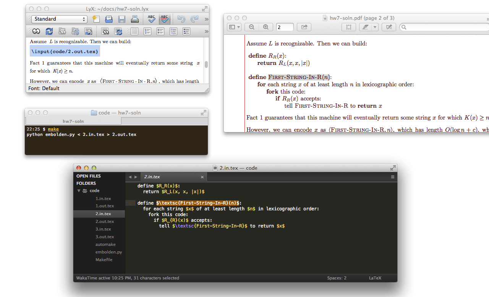

embolden
========

Bring LaTEX pseudocode to life.



Instructions
------------

 1. Clone or download the repo.
 2. Copy the `code` directory your LyX/TEX directory.
 3. Write pseudocode `*.in.tex` files.
 4. `cd code` and `make` (or `automake` if you have [watchr][] installed)
 5. Include the `*.out.tex` files in your LyX/TEX file:

    ```tex
    \input{code/example.out.tex}
    ```

[watchr]: https://github.com/mynyml/watchr
